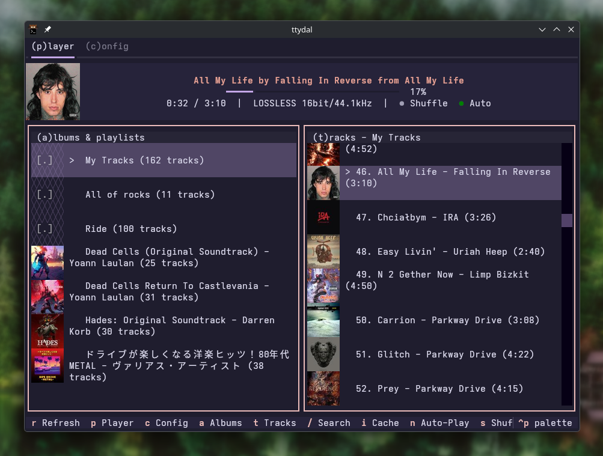

<p align="center">
  <a href="https://github.com/results-may-vary-org/ttydal">
    
  </a>
</p>
<h1 align="center">ttydal - Tidal in your termial!</h1>


## Inspiration

This project is heavily inspired by what [Maxteabag](https://github.com/Maxteabag) have done on is awesome project [sqlit](https://github.com/Maxteabag/sqlit).

## Features

- Browse your favorite albums, playlists, and tracks
- Fuzzy search across all loaded albums and tracks (`/` key)
- High-quality audio playback with three quality levels:
  - Max: Hi-Res Lossless (up to 24bit/192kHz)
  - High: Lossless (16bit/44.1kHz)
  - Low: AAC 320kbps
- Real-time stream quality verification showing actual bit depth and sample rate
- Auto-play next track
- Shuffle mode for randomized playback
- Visual indicators showing currently playing track and source album/playlist
- Playback controls with seeking support
- Smart tracks caching for faster navigation and search
- Player bar displaying track info, artist, album, playback time, and quality metrics
- Multiple theme options for interface customization
- Fully keyboard-driven interface
- Settings auto-save on change
- `new` Cover art display in albums list, tracks list, and player bar
- `new` Image caching for cover art (stored in `~/.cache/ttydal/images/`)
- `new` Vibrant color mode - colorize player bar text with album's vibrant color

*warning: this video contain audio of music, mind your volume*

https://github.com/user-attachments/assets/ea975bea-b8f6-4d1a-a309-ec2d54390c3a

## Requirements

- Python 3.13 or higher
- [uv](https://docs.astral.sh/uv/) for development
- Active Tidal subscription
- MPV media player (for audio playback)

## Installation

### For users

```bash
# pipx (recommend)
pipx install ttydal

# uv
uv tool install ttydal

# pip
pip install ttydal
```

Then use it:
```bash
ttydal
```

### For development

1. Clone the repository:
   ```bash
   git clone https://github.com/results-may-vary-org/ttydal.git
   cd ttydal
   ```

2. Install dependencies using uv:
   ```bash
   uv sync
   ```

3. Run the application:
   ```bash
   uv run ttydal
   ```

4. For development with auto-reload (optional):

   Install watchdog for automatic restart on file changes:
   ```bash
   uv add --dev watchdog
   ```

   Run with the development watcher:
   ```bash
   python dev.py
   ```

   This will automatically restart the application whenever you save changes to Python files.

## Getting started

1. Launch ttydal
2. On first run, you'll see a login modal
3. Press `o` to open the Tidal login URL in your browser
4. Complete the authentication in your browser
5. Press `l` to check login status
6. Once logged in, your favorite albums, playlists, and tracks will load automatically

## Keybindings

### Navigation

| Key | Action |
|-----|--------|
| `p` | Switch to Player page |
| `c` | Switch to Config page |
| `a` | Focus Albums/Playlists list |
| `t` | Focus Tracks list |
| `up/down` | Navigate through lists |
| `enter` | Select item / Play track (always starts from beginning) |
| `/` | Open fuzzy search |

### Search Modal

| Key | Action |
|-----|--------|
| `enter` | Navigate to selected album/track |
| `space` | Play selected track (tracks only) |
| `escape` | Close search |

### Playback Controls

| Key | Action |
|-----|--------|
| `space` | Toggle play/pause (works anywhere on player page) |
| `shift+left` | Seek backward 10 seconds |
| `shift+right` | Seek forward 10 seconds |
| `N` (shift+n) | Play next track |
| `P` (shift+p) | Play previous track |
| `n` | Toggle auto-play next track on/off |
| `s` | Toggle shuffle mode on/off |
| `r` | Refresh current list (also clears relevant cache) |
| `i` | Open cache info modal |
| `v` | Toggle vibrant mode |

### Login Modal

| Key | Action |
|-----|--------|
| `o` | Open login URL in browser |
| `c` | Copy login URL to clipboard |
| `l` | Check login status |
| `escape` | Close modal |

### Application

| Key | Action |
|-----|--------|
| `q` | Quit application |

## Configuration

All settings are accessible via the Config page (press `c`).

### Settings

- **Theme**: choose from 12 built-in themes
- **Audio Quality**: select default quality for your playback (max, high, or low)
- **Auto-Play**: enable or disable automatic playback of next track
- **Shuffle**: enable or disable shuffle mode
- **Debug Logging**: enable or disable debug logging to `~/.ttydal/debug.log`
- **API Logging**: *these logs can contains sensitive data* enable or disable API request/response logging to `~/.ttydal/debug-api.log`

All settings are automatically saved when changed.

## Images cache

Loaded images are cached into `~/.cache/ttydal`.

## Tracks cache

ttydal uses a caching system for tracks to improve performance and enable smart search.

### How it works

- In-memory cache: tracks are cached in memory (lost on app restart)
- TTL of 1 hour: each cached album/playlist expires after 1 hour
- Max 50,000 tracks: cache is limited by total track count, not album count.
- LRU eviction: when cache is full, oldest entries are evicted first
- Auto-preload: on startup, all albums are automatically preloaded into cache in the background (mostly for the search feature)

### Cache info modal

Press `i` to open the cache info modal and see current cache statistics.

### Cache invalidation

If you make changes to your playlists/favorites on the Tidal website:

- Press `r` on *Albums* list that clears the entire tracks cache and reloads albums
- Press `r` on *Tracks* list that invalidates only the current album/playlist cache and reloads

## Code of conduct, license, authors, changelog, contributing

See the following file :
- [code of conduct](CODE_OF_CONDUCT.md)
- [license](LICENSE)
- [authors](AUTHORS)
- [contributing](CONTRIBUTING.md)
- [changelog](CHANGELOG)
- [security](SECURITY.md)

## Want to participate? Have a bug or a request feature?

Do not hesitate to open a pr or an issue. I reply when I can.

### This project is possible because another cool projects exist

- [sqlit](https://github.com/Maxteabag/sqlit)
- [textual](https://textual.textualize.io/)
- [uv](https://docs.astral.sh/uv/)
- [tidalapi](https://pypi.org/project/tidalapi/)

## Want to support my work?

- [Give me a tips](https://github.com/sponsors/bouteillerAlan)
- [Give a star on github](https://github.com/results-may-vary-org/ttydal)
- Or just participate to the development :D

### Thanks !

